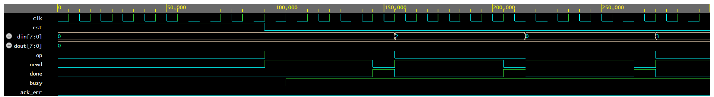

# I2C-master-slave
Overview

This project implements a simplified I2C (Inter-Integrated Circuit) communication protocol consisting of an I2C Master and I2C Slave. The design is written in Verilog, and the functionality is verified using a SystemVerilog testbench environment that includes generator, driver, monitor, and scoreboard components.

The project demonstrates RTL design and basic design verification methodology including constrained random stimulus generation and functional checking.

Features

• I2C Master module for initiating read/write transactions
• I2C Slave module for responding to master requests
• Top module integrating master and slave
• SystemVerilog testbench with verification components
• Constrained random stimulus generation
• Monitor and scoreboard for functional checking
• Simulation waveform analysis

```
I2C-master-slave
│
├── rtl
│   ├── i2c_master.v
│   ├── i2c_slave.v
│   └── i2c_top.v
│
├── tb
│   ├── i2c_if.sv
│   ├── transaction.sv
│   ├── generator.sv
│   ├── driver.sv
│   ├── monitor.sv
│   ├── scoreboard.sv
│   └── tb.sv
│
├── sim
│   └── waveform.png
│
└── README.md
```
Verification Environment:

The verification environment is implemented using SystemVerilog object-oriented testbench components.

Components used

Generator
Produces constrained random I2C transactions.

Driver
Drives stimulus to the DUT via the interface.

Monitor
Observes DUT signals and collects transaction data.

Scoreboard
Compares expected data with DUT output to verify correctness.

Mailbox communication is used between components to transfer transactions.

```
Generator → Driver → DUT (I2C Master + Slave)
                     ↓
                  Monitor
                     ↓
                 Scoreboard
```
The testbench verifies both read and write operations using randomized inputs.

Simulation Waveform

The waveform below shows I2C communication signals including clock, input data, output data, operation type, and transaction completion.
## Simulation Waveform



                 
